# 项目说明 #
 
 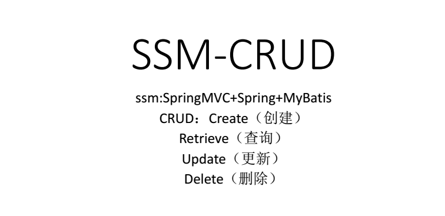

 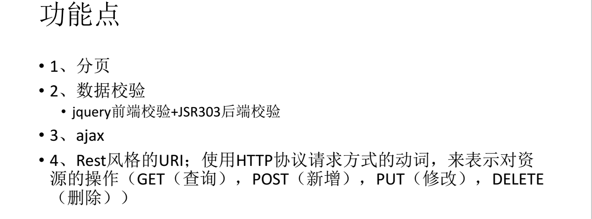

 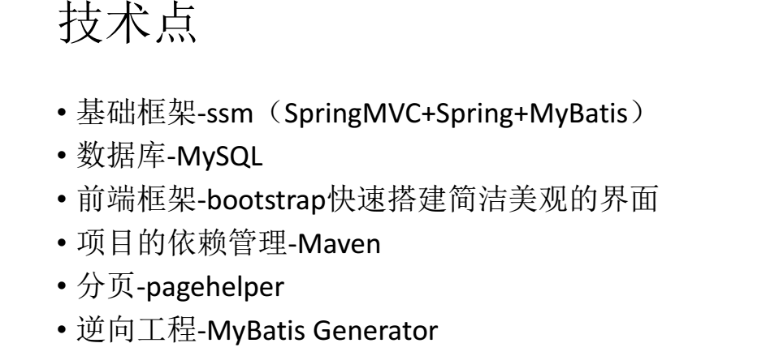

 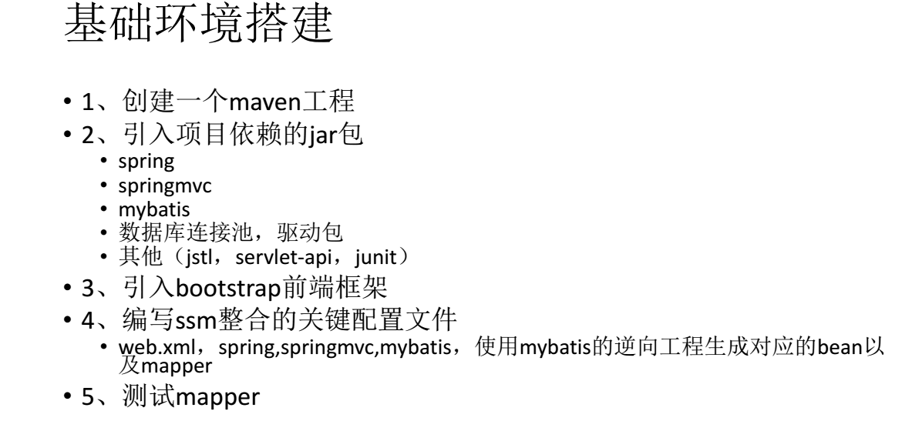

## maven中央包仓库 ##

 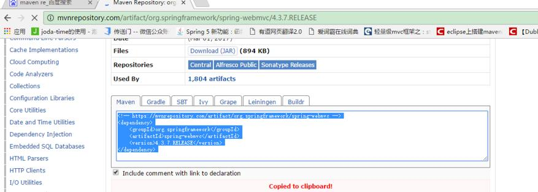

## 引入jar包 ##

    <!-- https://mvnrepository.com/artifact/org.mybatis.generator/mybatis-generator-core -->
    <dependency>
      <groupId>org.mybatis.generator</groupId>
      <artifactId>mybatis-generator-core</artifactId>
      <version>1.3.5</version>
    </dependency>

    <dependency>
      <groupId>junit</groupId>
      <artifactId>junit</artifactId>
      <version>3.8.1</version>
      <scope>test</scope>
    </dependency>
    <!--Spring-MVC、Spring-->
    <!-- https://mvnrepository.com/artifact/org.springframework/spring-webmvc -->
    <dependency>
      <groupId>org.springframework</groupId>
      <artifactId>spring-webmvc</artifactId>
      <version>4.3.7.RELEASE</version>
    </dependency>

    <!-- https://mvnrepository.com/artifact/org.springframework/spring-test -->
    <dependency>
      <groupId>org.springframework</groupId>
      <artifactId>spring-test</artifactId>
      <version>5.0.6.RELEASE</version>
      <scope>test</scope>
    </dependency>

    <!--JSR303数据校验,
    导入Hibernate-Validator
    tomcat7以下的服务器，el表达式,额外给服务器的lib包中替换新的标准的el-->
    <!-- https://mvnrepository.com/artifact/org.hibernate/hibernate-validator -->
    <dependency>
      <groupId>org.hibernate</groupId>
      <artifactId>hibernate-validator</artifactId>
      <version>5.4.1.Final</version>
    </dependency>

    <!--分页查询插件-->
    <dependency>
      <groupId>com.github.pagehelper</groupId>
      <artifactId>pagehelper</artifactId>
      <version>5.0.0</version>
    </dependency>

    <!--返回JSON字符串的支持-->
    <!-- https://mvnrepository.com/artifact/com.fasterxml.jackson.core/jackson-databind -->
    <dependency>
      <groupId>com.fasterxml.jackson.core</groupId>
      <artifactId>jackson-databind</artifactId>
      <version>2.8.8</version>
    </dependency>

    <!--Spring JDBC 事务管理-->
    <!-- https://mvnrepository.com/artifact/org.springframework/spring-jdbc -->
    <dependency>
      <groupId>org.springframework</groupId>
      <artifactId>spring-jdbc</artifactId>
      <version>4.3.7.RELEASE</version>
    </dependency>
    <!--Spring 面向切面编程-->
    <!-- https://mvnrepository.com/artifact/org.springframework/spring-aspects -->
    <dependency>
      <groupId>org.springframework</groupId>
      <artifactId>spring-aspects</artifactId>
      <version>4.3.7.RELEASE</version>
    </dependency>

    <!--MyBatis-Jar包-->
    <!-- https://mvnrepository.com/artifact/org.mybatis/mybatis -->
    <dependency>
      <groupId>org.mybatis</groupId>
      <artifactId>mybatis</artifactId>
      <version>3.4.2</version>
    </dependency>

    <!--MyBatis 整合Spring适配包-->
    <!-- https://mvnrepository.com/artifact/org.mybatis/mybatis-spring -->
    <dependency>
      <groupId>org.mybatis</groupId>
      <artifactId>mybatis-spring</artifactId>
      <version>1.3.1</version>
    </dependency>

    <!--数据库连接池、驱动-->
    <!-- https://mvnrepository.com/artifact/c3p0/c3p0 -->
    <dependency>
      <groupId>c3p0</groupId>
      <artifactId>c3p0</artifactId>
      <version>0.9.1.2 </version>
    </dependency>

    <!-- https://mvnrepository.com/artifact/mysql/mysql-connector-java -->
    <dependency>
      <groupId>mysql</groupId>
      <artifactId>mysql-connector-java</artifactId>
      <version>5.1.41</version>
    </dependency>

    <!--jstl servlet-API-->
    <!-- https://mvnrepository.com/artifact/jstl/jstl -->
    <dependency>
      <groupId>jstl</groupId>
      <artifactId>jstl</artifactId>
      <version>1.2</version>
    </dependency>

    <!-- https://mvnrepository.com/artifact/javax.servlet/servlet-api -->
    <dependency>
      <groupId>javax.servlet</groupId>
      <artifactId>javax.servlet-api</artifactId>
      <version>3.0.1</version>
      <scope>provided</scope>
    </dependency>
      <dependency>
          <groupId>junit</groupId>
          <artifactId>junit</artifactId>
          <version>RELEASE</version>
      </dependency>
    <dependency>
      <groupId>org.springframework</groupId>
      <artifactId>spring-test</artifactId>
      <version>RELEASE</version>
    </dependency>

## 引入bootstrap以及jQuery ##

 

    <html>
    <head>
        <title>Hello Bootstrap</title>
        
        <link rel="stylesheet" href="static/bootstrap-3.3.7-dist/css/bootstrap.min.css">
        
    </head>
    <body>
        <button type="button" class="btn bg-danger">Test</button>
    </body>
    </html>

## web.xml配置 引入spring、springmvc、过滤器配置文件 使用Rest风格的URI ##

    <!--1、启动Spring的容器-->
    <!--需要 ContextLoaderListener-->
    <context-param>
    <param-name>contextConfigLocation</param-name>
    <param-value>classpath:applicationContext.xml</param-value>
    </context-param>
    <listener>
    <listener-class>org.springframework.web.context.ContextLoaderListener</listener-class>
    </listener>

    <!--2、配置SpringMVC的前端控制器，拦截所有的请求-->
    <servlet>
    <servlet-name>dispatcherServlet</servlet-name>
    <servlet-class>org.springframework.web.servlet.DispatcherServlet</servlet-class>
    <load-on-startup>1</load-on-startup>
     </servlet>
    <servlet-mapping>
    <servlet-name>dispatcherServlet</servlet-name>
    <url-pattern>/</url-pattern>
    </servlet-mapping>

     <!--3、字符编码过滤器、一定要放在最前面-->
     <filter>
    <filter-name>CharacterEncodingFilter</filter-name>
    <filter-class>org.springframework.web.filter.CharacterEncodingFilter</filter-class>
    <init-param>
      <param-name>encoding</param-name>
      <param-value>utf-8</param-value>
    </init-param>
    <init-param>
      <param-name>forceRequestEncoding</param-name>
      <param-value>true</param-value>
    </init-param>
    <init-param>
      <param-name>forceResponseEncoding</param-name>
      <param-value>true</param-value>
    </init-param>
    </filter>
    <filter-mapping>
    <filter-name>CharacterEncodingFilter</filter-name>
    <url-pattern>/*</url-pattern>
    </filter-mapping>

    <!--4、使用Rest风格的URI，将页面普通的POST请求转为指定的delete或者put请求-->
    <filter>
    <filter-name>HiddenHttpMethodFilter</filter-name>
    <filter-class>org.springframework.web.filter.HiddenHttpMethodFilter</filter-class>
    </filter>
    <filter-mapping>
    <filter-name>HiddenHttpMethodFilter</filter-name>
    <url-pattern>/*</url-pattern>
    </filter-mapping>

    <!--PUT请求-->
    <filter>
    <filter-name>HttpPutFormContentFilter</filter-name>
    <filter-class>org.springframework.web.filter.HttpPutFormContentFilter</filter-class>
    </filter>
    <filter-mapping>
    <filter-name>HttpPutFormContentFilter</filter-name>
    <url-pattern>/*</url-pattern>
    </filter-mapping>

## 配置springmvc  dispatcherServlet-servlet.xml ##

    <!--SpringMVC的配置文件，包含网站的跳转逻辑控制，配置-->
    <context:component-scan base-package="com.weibin" use-default-filters="false">
        <!--只扫描控制器-->
        <context:include-filter type="annotation" expression="org.springframework.stereotype.Controller"/>
    </context:component-scan>
    <!--配置视图解析器，方便页面返回-->
    <bean class="org.springframework.web.servlet.view.InternalResourceViewResolver">
        <property name="prefix" value="/WEB-INF/views/"></property>
        <property name="suffix" value=".jsp"></property>
    </bean>

    <!--两个标准配置-->
    <!--将springMVC不能处理的请求交给tomcat-->
    <mvc:default-servlet-handler/>
    <!--能支持springMVC更高级的一些功能，JSR303校验，快捷ajax请求，映射动态请求-->
    <mvc:annotation-driven/>

## 配置spring  applicationContext.xml ##

## 配置dbconfig.properties ##

    jdbc.jdbcUrl=jdbc:mysql://localhost:3306/ssm_crud
    jdbc.driverClass=com.mysql.jdbc.Driver
    jdbc.user=root
    jdbc.password=root

    <!--Spring 的配置文件，主要配置和业务逻辑有关的-->
    <!--数据源，事务控制，xxx-->
    <context:property-placeholder location="classpath:dbconfig.properties"/>
    <bean id="pooledDataSource" class="com.mchange.v2.c3p0.ComboPooledDataSource">
        <property name="jdbcUrl" value="${jdbc.jdbcUrl}"></property>
        <property name="driverClass" value="${jdbc.driverClass}"></property>
        <property name="user" value="${jdbc.user}"></property>
        <property name="password" value="${jdbc.password}"></property>
    </bean>

    <!--配置和Mybatis的整合-->
    <bean id="sqlSessionFactory" class="org.mybatis.spring.SqlSessionFactoryBean">
        <property name="configLocation" value="classpath:mybatis-config.xml"></property>
        <property name="dataSource" ref="pooledDataSource"></property>
        <!--mapper文件的位置-->
        <property name="mapperLocations" value="classpath:mapper/*.xml"></property>
    </bean>

    <!--配置扫描器，将Mybatis接口的实现加入到ioc容器中-->
    <bean class="org.mybatis.spring.mapper.MapperScannerConfigurer">
        <!--扫描所有的dao接口的实现。加入到ioc容器中-->
        <property name="basePackage" value="com.weibin.dao"></property>
    </bean>

    <!--配置一个可以执行批量的sqlSession-->
    <bean id="sqlSession" class="org.mybatis.spring.SqlSessionTemplate">
        <constructor-arg name="sqlSessionFactory" ref="sqlSessionFactory"></constructor-arg>
        <constructor-arg name="executorType" value="BATCH"></constructor-arg>
    </bean>

    <!--事务控制的配置-->
    <bean id="transactionManager" class="org.springframework.jdbc.datasource.DataSourceTransactionManager">
        <!--控制主数据源-->
        <property name="dataSource" ref="pooledDataSource"></property>
    </bean>

    <!--开启基于注解的事务，或者使用xml配置形式的事务-->
    <aop:config>
        <!--切入点表达式-->
        <aop:pointcut id="txPoint" expression="execution(* com.weibin.service..*(..))"/>
        <!--配置事务增强-->
        <aop:advisor advice-ref="txAdvice" pointcut-ref="txPoint"/>
    </aop:config>

    <!--配置事务增强，事务如何切入-->
    <tx:advice id="txAdvice" transaction-manager="transactionManager">
        <tx:attributes>
            <!--所有方法都是事务-->
            <tx:method name="*"/>
            <!--以get开始的所有方法-->
            <tx:method name="get*" read-only="true"/>
        </tx:attributes>
    </tx:advice>

    <!--spring配置文件的核心点（数据源、mybatis的整合、事务控制）-->
    </beans>

## 配置mybatis-config.xml##

    configuration>

    <settings>
        <setting name="mapUnderscoreToCamelCase" value="true"/>
        <!--当返回行的所有列都是空时，MyBatis默认返回null-->
        <setting name="returnInstanceForEmptyRow" value="true"/>
    </settings>

    <typeAliases>
        <package name="com.weibin.bean"/>
    </typeAliases>

    <plugins>
        <plugin interceptor="com.github.pagehelper.PageInterceptor">
            <property name="reasonable" value="true"/>
        </plugin>
    </plugins>
    </configuration>

## 创建数据库表##

 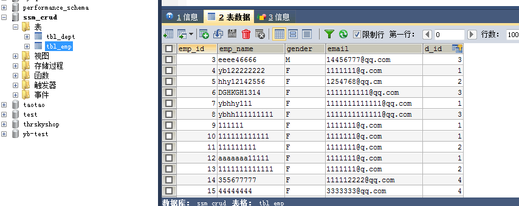

## mbg.xml逆向工程生成bean及mapper##

    <generatorConfiguration>

    <context id="DB2Tables" targetRuntime="MyBatis3">
        <!--数据库连接-->
        <jdbcConnection driverClass="com.mysql.jdbc.Driver"
                        connectionURL="jdbc:mysql://localhost:3306/ssm_crud"
                        userId="root"
                        password="root">
        </jdbcConnection>

        <javaTypeResolver >
            <property name="forceBigDecimals" value="false" />
        </javaTypeResolver>

        <!--指定JavaBean生成位置-->
        <javaModelGenerator targetPackage="com.weibin.bean" targetProject=".\src\main\java">
            <property name="enableSubPackages" value="true" />
            <property name="trimStrings" value="true" />
        </javaModelGenerator>

        <!--sql映射文件生成文件位置-->
        <sqlMapGenerator targetPackage="mapper"  targetProject=".\src\main\resources">
            <property name="enableSubPackages" value="true" />
        </sqlMapGenerator>

        <!--指定dao接口生成的位置，mapper接口-->
        <javaClientGenerator
                type="XMLMAPPER"
                targetPackage="com.weibin.dao"
                targetProject=".\src\main\java">
            <property name="enableSubPackages" value="true" />
        </javaClientGenerator>

        <!--指定每个表的生成策略-->
        <table tableName="tbl_emp" domainObjectName="Employee"></table>
        <table tableName="tbl_dept" domainObjectName="Department"></table>
    </context>
## mbg.xml逆向工程生成bean及mapper后修改Mapper文件带部门的查询##

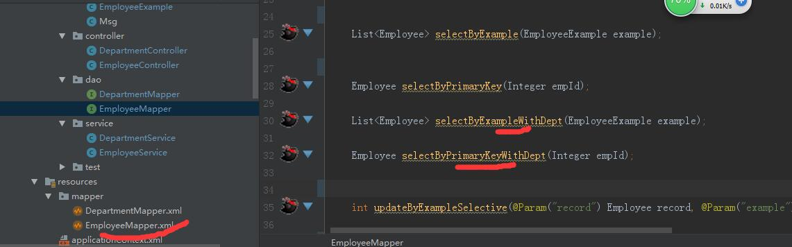

    <!--查询员工同时带部门的-->
    <select id="selectByExampleWithDept" resultMap="WithDeptResultMap">
    select
    <if test="distinct">
        distinct
    </if>
    <include refid="WithDept_Column_List" />
    from tbl_emp e
    left join tbl_dept d on e.d_id=d.dept_id
    <if test="_parameter != null">
       <include refid="Example_Where_Clause" />
    </if>
    <if test="orderByClause != null">
      order by ${orderByClause}
    </if>
    </select>
    <select id="selectByPrimaryKeyWithDept" resultMap="WithDeptResultMap">
    select
    <include refid="WithDept_Column_List" />
    from tbl_emp e
    left join tbl_dept d on e.'d_id'=d.'dept_id'
    where emp_id = #{empId,jdbcType=INTEGER}
    </select>
    <!--查询员工不带部门的-->
    <select id="selectByExample" parameterType="com.weibin.bean.EmployeeExample" resultMap="BaseResultMap">
 
## 搭建spring测试##

    /**
      * 测试dao层的工作

     */
    @RunWith(SpringJUnit4ClassRunner.class)
    @ContextConfiguration(locations = {"classpath:applicationContext.xml"})
    public class MapperTest {

    @Autowired
    DepartmentMapper departmentMapper;

    @Autowired
    EmployeeMapper employeeMapper;

    Employee employee;

    @Autowired
    SqlSession sqlSession;

    @Test
    public void testCRUD(){
       //        ApplicationContext ioc =
     //                new ClassPathXmlApplicationContext("applicationContext.xml");
        System.out.println(departmentMapper);
        employee = new Employee();
        //插入部门
    //        Department department1 = new Department(null, "开发部");
    //        Department department2 = new Department(null, "测试部");
    //        departmentMapper.insertSelective(department1);
    //        departmentMapper.insertSelective(department2);
        // 插入员工
    //        employeeMapper.insertSelective(
    //                new Employee(null, "Jerry", "M", "11111abc@163.com",1)
    //        );

        //批量插入多个员工。使用可执行批量操作的sqlSession
      //        EmployeeMapper mapper = sqlSession.getMapper(EmployeeMapper.class);
    / /        for (int i = 0; i < 1000; i++){
    //            String uuid = UUID.randomUUID().toString().substring(0, 5);
    //            mapper.insertSelective(new Employee(
    //                    null, uuid, "M", uuid + "@163.com", 1
    //            ));
    //        }
    //        System.out.println("批量完成。。。");
        for (int i = 1; i<1000; i++){
            int id = employeeMapper.selectByPrimaryKey(i).getEmpId();
            if (id%2==1){

            }
        }

     }
    }

 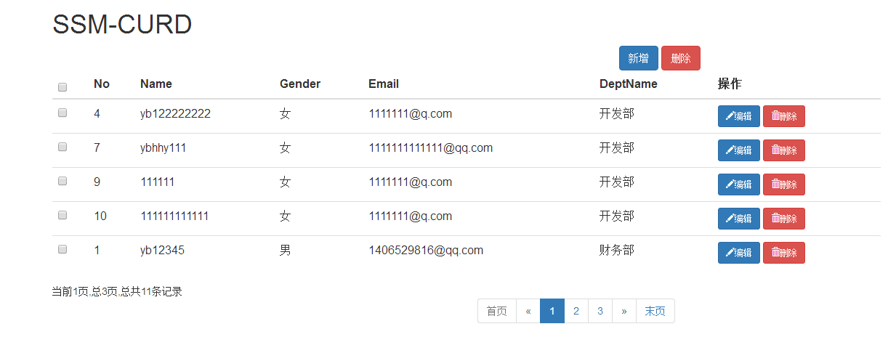

### EmployeeController ###

   **
    * 处理员工的CRUD请求

     */

     @Controller
     public class EmployeeController {

    @Autowired
    EmployeeService employeeService;

    /**
     * 单个批量二合一
     * 批量：1-2-3
     * 单个删除：1
     * @param ids
     * @return
     */
    @ResponseBody
    @RequestMapping(value = "/emp/{ids}", method = RequestMethod.DELETE)
    public Msg deleteEmp(@PathVariable("ids") String ids){
        if (ids.contains("-")){
            List<Integer> del_ids = new ArrayList<Integer>();
            String[] str_ids = ids.split("-");
            //组装id的集合
            for (String str : str_ids){
                del_ids.add(Integer.parseInt(str));
            }
            employeeService.deleteBatch(del_ids);
        }else {
            Integer id = Integer.parseInt(ids);
            employeeService.delete(id);
        }
        return Msg.success();
    }

    /**
     * 请求体中有数据，Employee拼装不上，
     * Tomcat ：请求体中的数据，封装成map
     *        SpringMVC封装POJO对象的时候，
     *        会把每个属性的值调用request.getParamter("");
     *
     * Ajax发送PUT请求会引发异常：
     *          Tomcat看到PUT不会封装请求体中的数据为map
     * 若要能直接支持PUT之类的请求，需要重新封装请求体中的数据
     * 配置HttpPutFormContentFilter,
     * 将请求体中的数据解析包装成一个map
     * request被重新包装,getParameter()被重写,
     * 就会重自己封装的map中取数据
     *
     * 员工更新
     * @param employee
     * @return
     */
    @ResponseBody
    @RequestMapping(value = "/emp/{empId}", method = RequestMethod.PUT)
    public Msg saveEmp(Employee employee){
        System.out.println("将要更行的数据： " + employee.toString());
        employeeService.updateEmp(employee);
        return Msg.success();
    }

    /**
     * 查询 根据id
     * @param id
     * @return
     */
    @RequestMapping(value = "/emp/{id}", method = RequestMethod.GET)
    @ResponseBody
    public Msg getEmp(@PathVariable("id") Integer id){
        Employee employee = employeeService.getEmp(id);
        return Msg.success().add("emp", employee);
    }

    /**
     * 检查用户名是否可用
     * @param empName
     * @return
     */
    @ResponseBody
    @RequestMapping("/checkuser")
    public Msg checkuser(@RequestParam("empName") String empName){
        //先判断用户名是否是合法的表达式
        String regName = "(^[a-zA-Z0-9_-]{6,16}$)|([\\u2E80-\\u9FFF]{2,5})";
        boolean reg = empName.matches(regName);
        if (!reg){
            return Msg.fail().add("va_msg", "用户名应为6-16位英文和数字的组合或者2-5位中文。。。");
        }
        boolean b = employeeService.checkUser(empName);
        if (b){
            return Msg.success();
        }else {
            return Msg.fail().add("va_msg", "用户名不可用");
        }
    }

    /**
     * 增加 并保存员工数据
     * 1.支持JSR303校验
     * 2.导入Hibernate-Validator
     * @param employee
     * @return
     */
    @RequestMapping(value="/emp", method = RequestMethod.POST)
    @ResponseBody
    public Msg saveEmp(@Valid Employee employee, BindingResult result){
        if (result.hasErrors()){
            //校验失败，返回时报，显示错误信息
            Map<String, Object> map = new HashMap<String, Object>();
            List<FieldError> errors = result.getFieldErrors();
            for (FieldError fieldError : errors){
                System.out.println("错误字段名：" + fieldError.getField());
                System.out.println("错误信息：" + fieldError.getDefaultMessage());
                map.put(fieldError.getField(), fieldError.getDefaultMessage());
            }
            return Msg.fail().add("errorFields", map);
        }else {
            employeeService.saveEmp(employee);
            return Msg.success();
        }
    }

    /**
         * RequestMapping正常工作需要导入jackson包。负责将对象转换为字符串
         * @param pn
         * @return
     */
    @RequestMapping("/emps")
    @ResponseBody
    public Msg getEmpsWithJSON(@RequestParam(value = "pn", defaultValue = "1") Integer pn){
        //这不是一个分页查询
        //引入PageHelper分页查询
        //在查询之前只需要调用，传入页码以及分页的大小
        PageHelper.startPage(pn, 5);
        //startPage后面紧跟的这个查询就是一个分页查询
        List<Employee> employees = employeeService.getAll();

        //使用PageInfo包装查询后的结果，只需要将PageInfo交给页面就行了
        //封装了详细的分页信息，包括有我们查询出来的数据，传入连续显示的页数
        PageInfo<Employee> page = new PageInfo<Employee>(employees, 5);

        return Msg.success().add("pageInfo", page);
    }

     /**
     * 查询员工数据（分页查询）
     * @return
     */
    //@RequestMapping("/emps")
    public String getEmps(@RequestParam(value = "pn", defaultValue = "1") Integer pn, Model model){
        //这不是一个分页查询
        //引入PageHelper分页查询
        //在查询之前只需要调用，传入页码以及分页的大小
        PageHelper.startPage(pn, 5);
        //startPage后面紧跟的这个查询就是一个分页查询
        List<Employee> employees = employeeService.getAll();

        //使用PageInfo包装查询后的结果，只需要将PageInfo交给页面就行了
        //封装了详细的分页信息，包括有我们查询出来的数据，传入连续显示的页数
        PageInfo<Employee> page = new PageInfo<Employee>(employees, 5);

        model.addAttribute("pageInfo", page);

        return "list";
    }
    }

 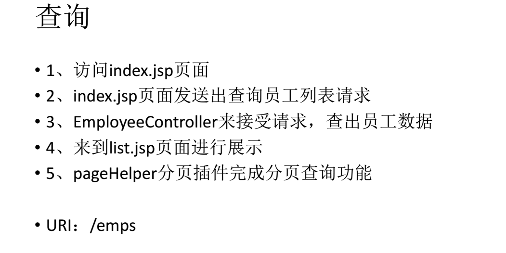

 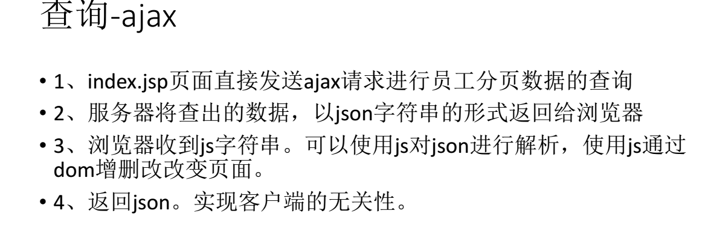

 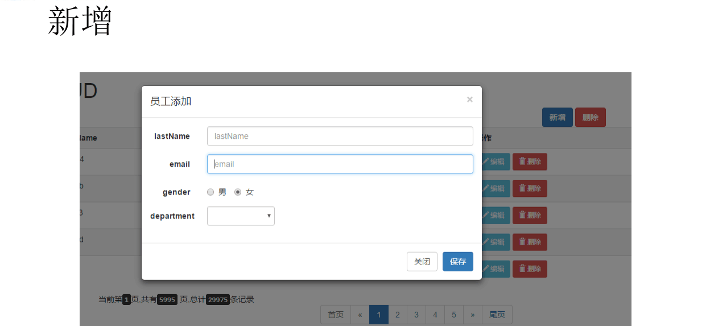

 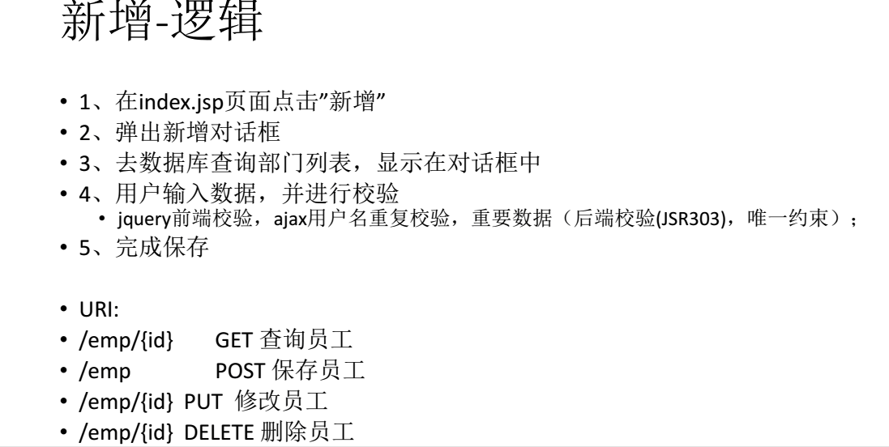

 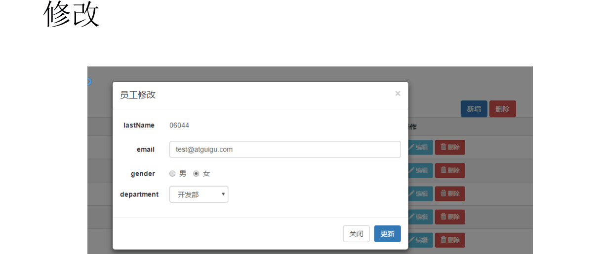

 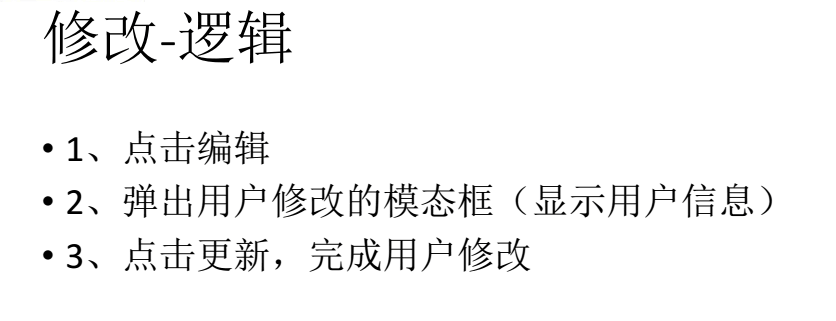

 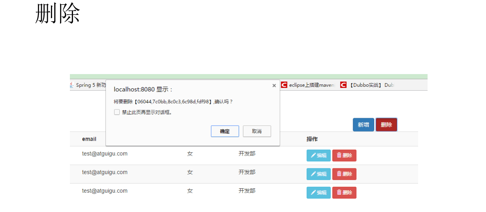

 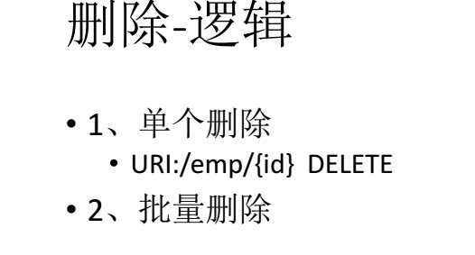

 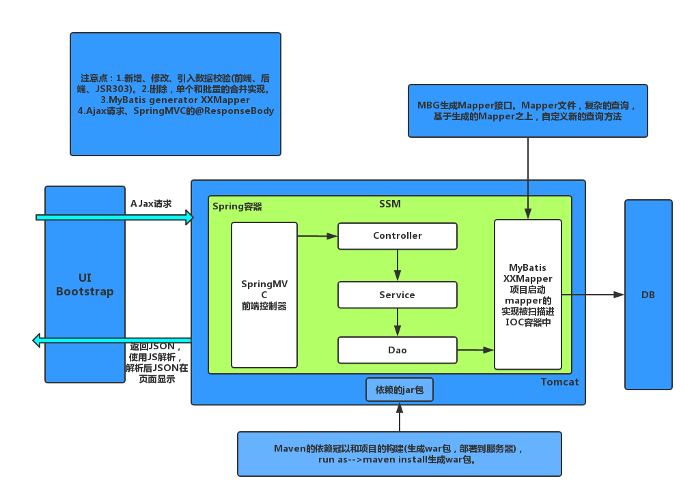

